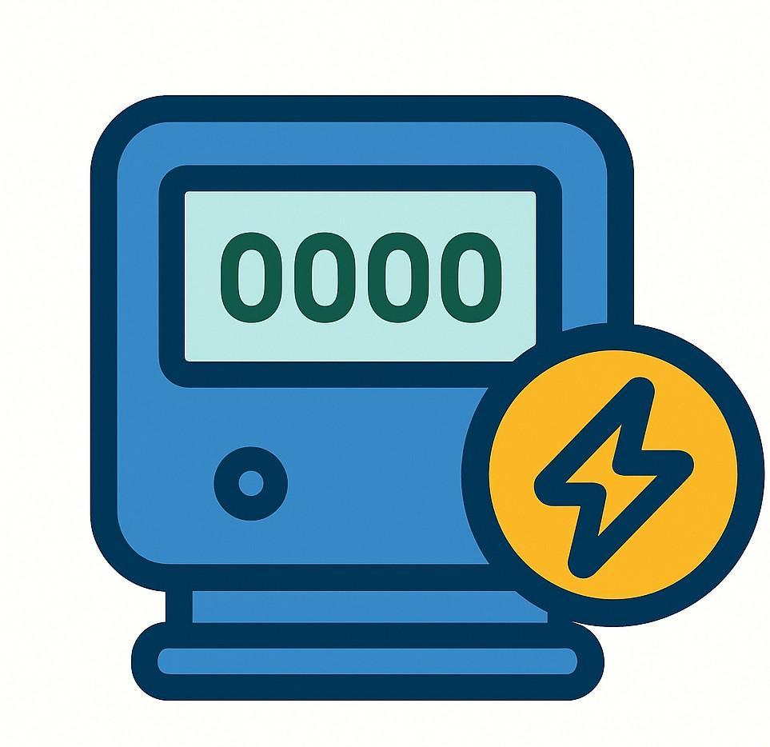
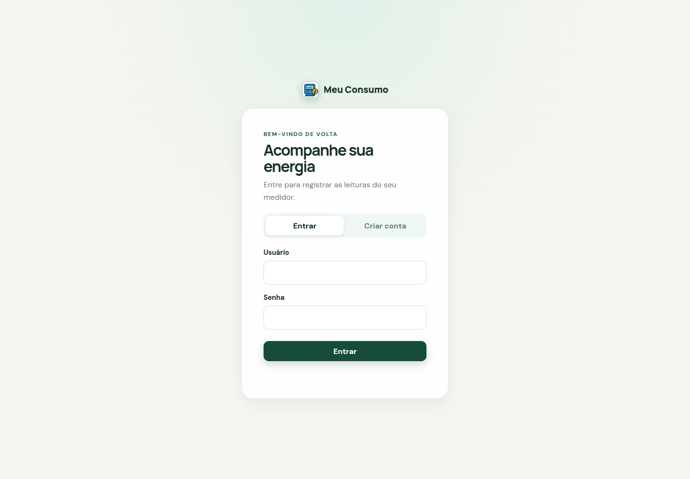
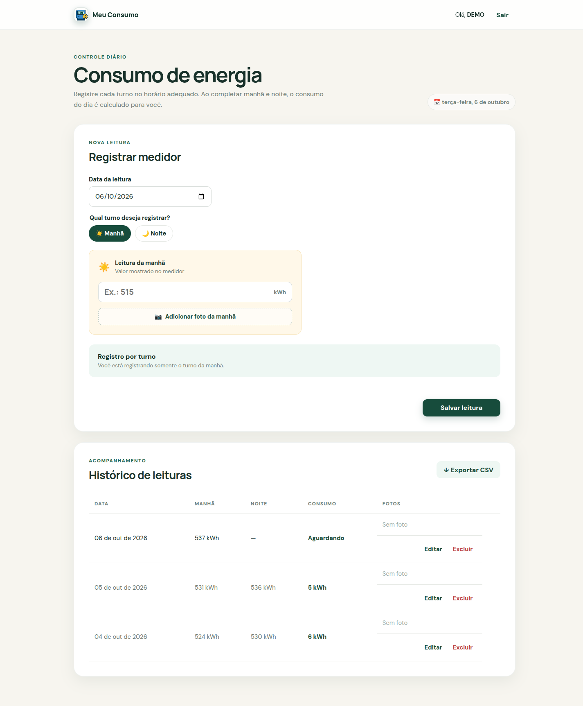
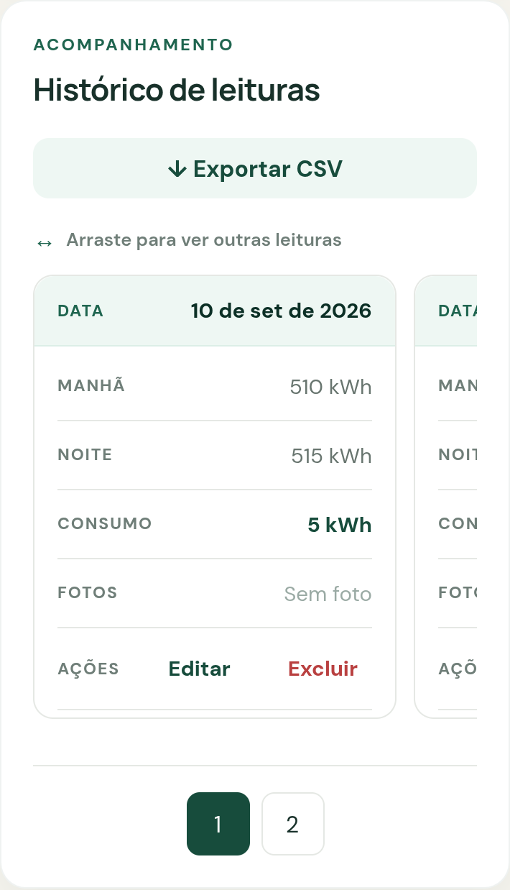

<p align="center">
  
</p>

# Meu Consumo

Aplicação web para registrar leituras de medidores elétricos pela manhã e à
noite, calcular o consumo diário e acompanhar o histórico de cada residência.
O projeto funciona com PHP puro, JavaScript, CSS e arquivos JSON no servidor,
sem banco de dados ou gerenciador de dependências.

## Aplicação online

Acesse a [aplicação Meu Consumo](https://consumo-energisa.wasxtech.com.br/public/).

## ⚡ Funcionalidades

- Criação de conta e autenticação com sessão PHP.
- Armazenamento de senhas com hash seguro.
- Separação dos históricos por residência.
- Registro das leituras da manhã e da noite.
- Cálculo automático do consumo diário em kWh.
- Envio opcional de fotos do medidor para cada turno.
- Edição e exclusão de leituras.
- Histórico paginado e exportação em CSV.
- Painel administrativo com usuários, leituras e filtro por residência.
- Interface responsiva para computadores e dispositivos móveis.
- Histórico em carrossel com navegação por toque na versão mobile.

## 📸 Capturas de tela

### Acesso



### Registro e histórico de consumo



### Histórico no celular

<p align="center">
  
</p>

No mobile, cada leitura aparece em um cartão com a data destacada. Você pode
arrastar o histórico horizontalmente para navegar entre os registros da página.
A paginação numérica continua disponível para acessar os demais grupos de
leituras. Em telas maiores, o histórico mantém o formato de tabela.

As imagens foram capturadas da aplicação em execução com dados de demonstração
armazenados em uma cópia temporária dos arquivos JSON.

## 🚀 Como executar

### Pré-requisitos

- PHP 7.4 ou superior.
- Extensão PHP `fileinfo` habilitada para validar imagens.
- Sessões PHP habilitadas.
- Permissão de escrita em `data/` e `public/uploads/`.

O projeto não exige Composer, Node.js ou banco de dados para executar a
aplicação.

### Ambiente local

1. Abra um terminal na raiz do projeto.
2. Inicie o servidor de desenvolvimento do PHP:

   ```bash
   php -S localhost:8000 -t public
   ```

3. Acesse `http://localhost:8000`.
4. Se ainda não houver um usuário, selecione **Criar conta** para cadastrar o
   primeiro acesso.

A aplicação não usa variáveis de ambiente. Os caminhos dos dados e uploads
ficam definidos em `bootstrap.php`.

### Hospedagem

Em produção, configure o documento raiz do Apache, Nginx ou servidor compatível
com PHP para apontar para `public/`. Assim, `app/`, `data/`, `views/` e
`bootstrap.php` permanecem fora do acesso público.

Se a hospedagem não permitir alterar a raiz pública, publique o projeto
completo. O `index.php` da raiz encaminha o acesso para `public/`. Em servidores
que não interpretam `.htaccess`, crie regras equivalentes para bloquear o
acesso direto a `data/` e a execução de scripts em `public/uploads/`.

## 💾 Persistência dos dados

A aplicação persiste os dados em arquivos JSON no servidor:

- `data/usuarios.json` armazena as contas e os dados de acesso necessários.
- `data/consumo.json` armazena as leituras de energia.

Na primeira execução, `bootstrap.php` cria esses arquivos a partir de
`data/usuarios.exemplo.json` e `data/consumo.exemplo.json`, caso eles ainda não
existam. O usuário do processo PHP precisa ter permissão para criar e atualizar
os arquivos.

Os JSONs reais fazem parte do funcionamento da instalação e não devem ser
apagados nem tratados como arquivos temporários. Faça cópias de segurança antes
de qualquer manutenção. A política existente do repositório mantém os arquivos
reais fora do Git porque eles podem conter dados privados; os modelos
sanitizados `*.exemplo.json` permanecem versionados.

Essa política de versionamento não muda a arquitetura: a aplicação continua
lendo e gravando diretamente nos JSONs do servidor.

## 🛠 Tecnologias

- PHP 7.4+ para interface, API, sessões e regras da aplicação.
- JavaScript com módulos ES para interação no navegador.
- HTML5 e CSS3 para estrutura e apresentação responsiva.
- JSON para persistência no servidor.
- Apache `.htaccess` para proteção adicional de dados e uploads.
- GitHub Actions para verificações de qualidade e segurança.

## 📁 Estrutura do projeto

```text
.
├── app/
│   ├── Aplicacao/             # Casos de uso e serviços
│   ├── Dominio/               # Entidades e regras de negócio
│   ├── Http/                  # Requisições, respostas e controladores
│   └── Infraestrutura/        # Repositórios JSON e fotos
├── data/                      # JSONs persistentes e modelos sanitizados
├── docs/
│   ├── diagramas/             # Diagramas Mermaid e SVG
│   └── screenshots/           # Capturas reais da interface
├── public/
│   ├── assets/                # CSS, JavaScript e identidade visual
│   ├── uploads/               # Fotos enviadas pelos usuários
│   ├── api.php                # Roteamento da API
│   └── index.php              # Entrada pública da interface
├── tests/                     # Testes PHP, HTTP e JavaScript
├── tools/ci/                  # Verificações usadas pela CI
├── views/                     # Páginas e componentes PHP
├── bootstrap.php              # Autoload e configuração de caminhos
└── index.php                  # Entrada para hospedagens simples
```

## Documentação de engenharia

Consulte o [índice da documentação](docs/README.md) para acessar:

- [Levantamento de requisitos](docs/requisitos.md).
- [Modelo de dados e DER](docs/modelo-de-dados.md).
- [Modelagem UML](docs/uml.md).

## Documentos do projeto

- [Como contribuir](CONTRIBUTING.md).
- [Termos de Uso](TERMS.md).
- [Política de Privacidade](PRIVACY.md).
- [Licença MIT](LICENSE).

O projeto adota práticas voltadas à transparência, minimização de dados e
proteção dos direitos dos titulares. A conformidade jurídica completa também
depende dos processos, da infraestrutura e da identificação do responsável por
cada instalação.

## Fotos do medidor

O sistema aceita imagens JPEG, PNG e WebP de até 5 MB. O backend verifica o
tipo real com `fileinfo`, gera um nome aleatório e salva o arquivo em
`public/uploads/`.

## Qualidade e testes

Execute as mesmas verificações usadas pela integração contínua:

```bash
bash tools/ci/verificar-padrao.sh
bash tools/ci/verificar-seguranca.sh
```

Esses scripts verificam sintaxe PHP e JavaScript, executam os testes da
aplicação, validam os modelos JSON e procuram problemas de segurança.

## Cuidados antes da publicação

1. Use senhas exclusivas para as contas.
2. Mantenha os JSONs reais protegidos contra acesso público.
3. Garanta permissão de escrita somente para o processo PHP.
4. Impeça a execução de scripts em `public/uploads/`.
5. Ative HTTPS no domínio.
6. Faça cópias de segurança de `data/` e `public/uploads/`.

## Licença

Este projeto é distribuído sob a [Licença MIT](LICENSE). Você pode usar,
copiar, modificar e distribuir o código, desde que preserve o aviso de
copyright e o texto da licença, mantendo o crédito a Wellington Xavier.
