# Modelo de dados e DER

## 1. Objetivo

Este documento descreve como a aplicação persiste os dados atualmente em JSON
e apresenta um modelo relacional recomendado para uma futura migração.

O DER atual é **lógico**. Cada entidade representa um objeto ou uma lista
embutida nos arquivos, e não uma tabela física.

## 2. Armazenamento atual

| Arquivo | Responsabilidade | Versionado |
| --- | --- | --- |
| `data/usuarios.json` | Credenciais e histórico de acessos reais. | Não |
| `data/consumo.json` | Leituras e referências para fotos reais. | Não |
| `data/usuarios.exemplo.json` | Modelo sanitizado de usuários. | Sim |
| `data/consumo.exemplo.json` | Modelo vazio de leituras. | Sim |
| `public/uploads/` | Arquivos físicos das fotos. | Não |

## 3. DER lógico atual



[Código-fonte Mermaid do DER atual](diagramas/der-json-atual.mmd)

O histórico de acessos fica embutido dentro de cada usuário. As informações das
fotos ficam embutidas na leitura, enquanto o arquivo binário fica em
`public/uploads/`.

Não existe referência entre usuário e leitura. Portanto, o sistema atual não
consegue determinar quem criou ou alterou uma leitura.

## 4. Dicionário de dados atual

### 4.1 Usuário

| Campo JSON | Tipo | Obrigatório | Descrição |
| --- | --- | --- | --- |
| `username` | Texto | Sim | Nome único usado no login. |
| `password` | Texto | Sim | Senha atual em texto simples. |
| `last_ip` | Texto ou nulo | Não | Último endereço IP autenticado. |
| `accesses` | Lista | Sim | Histórico embutido de acessos. |

### 4.2 Acesso

| Campo JSON | Tipo | Obrigatório | Descrição |
| --- | --- | --- | --- |
| `at` | Data e hora ISO 8601 | Sim | Instante da autenticação. |
| `ip` | Texto | Sim | Endereço IP informado ao servidor. |

### 4.3 Leitura

| Campo JSON | Tipo | Obrigatório | Descrição |
| --- | --- | --- | --- |
| `identificador` | Inteiro | Sim | Identificador sequencial local. |
| `data` | Data `AAAA-MM-DD` | Sim | Data de referência da leitura. |
| `leitura_manha` | Inteiro | Sim | Valor acumulado do medidor pela manhã. |
| `leitura_noite` | Inteiro | Sim | Valor acumulado do medidor à noite. |
| `consumo` | Inteiro | Sim | Diferença entre noite e manhã. |
| `foto_manha` | Texto ou nulo | Não | Caminho relativo da foto matutina. |
| `horario_foto_manha` | Data e hora ou nulo | Não | Horário associado à foto matutina. |
| `foto_noite` | Texto ou nulo | Não | Caminho relativo da foto noturna. |
| `horario_foto_noite` | Data e hora ou nulo | Não | Horário associado à foto noturna. |

## 5. Exemplo de leitura persistida

```json
{
  "identificador": 4,
  "data": "2026-08-13",
  "leitura_manha": 515,
  "leitura_noite": 518,
  "consumo": 3,
  "foto_manha": "uploads/foto-exemplo-manha.jpg",
  "horario_foto_manha": "2026-08-13T08:02:00-04:00",
  "foto_noite": "uploads/foto-exemplo-noite.jpg",
  "horario_foto_noite": "2026-08-13T20:11:00-04:00"
}
```

## 6. Restrições e integridade atuais

- `identificador` é calculado como o maior identificador mais um.
- `data` deve representar uma data válida.
- `leitura_manha` e `leitura_noite` não podem ser negativas.
- `leitura_noite` deve ser maior ou igual a `leitura_manha`.
- `consumo` deve corresponder a `leitura_noite - leitura_manha`.
- Cada caminho de foto deve apontar para um arquivo controlado em `uploads/`.
- O horário da foto deve ser nulo quando o caminho da foto for nulo.
- O modelo atual não impede duas leituras na mesma data.
- O modelo atual não aplica chave estrangeira entre usuário e leitura.

## 7. Modelo relacional recomendado

Quando o projeto precisar de concorrência, auditoria, múltiplos medidores ou
consultas mais avançadas, migre o armazenamento para SQLite, PostgreSQL ou
MySQL. O modelo recomendado separa usuários, acessos, unidades, medidores,
leituras e fotos.



[Código-fonte Mermaid do DER recomendado](diagramas/der-relacional-recomendado.mmd)

### 7.1 Decisões do modelo futuro

- Um usuário pode registrar várias leituras.
- Uma unidade consumidora pode possuir um ou mais medidores ao longo do tempo.
- Um medidor pode receber várias leituras diárias.
- Uma leitura pode possuir zero, uma ou duas fotos.
- O período da foto usa um valor controlado: `MANHA` ou `NOITE`.
- A combinação entre medidor e data deve ser única.
- O consumo pode ser calculado na aplicação ou armazenado com uma restrição.
- Senhas devem usar hash, nunca texto simples.

### 7.2 Chaves e índices recomendados

- Chave primária em todos os campos `id`.
- Chave única para `usuario.nome`.
- Chave única composta para `leitura(medidor_id, data)`.
- Chave única composta para `foto_leitura(leitura_id, periodo)`.
- Índice para `acesso(usuario_id, acessado_em)`.
- Índice para `leitura(data)`.

## 8. Estratégia de migração

1. Crie o esquema relacional com as restrições definidas.
2. Cadastre uma unidade e um medidor para representar a instalação atual.
3. Migre usuários aplicando hash às senhas.
4. Migre acessos embutidos para a tabela `acesso`.
5. Migre leituras e associe-as ao medidor e a um usuário administrativo.
6. Migre as referências de foto para `foto_leitura`.
7. Compare totais e consumos entre JSON e banco.
8. Faça uma cópia de segurança antes de trocar o repositório da aplicação.

Como a camada de aplicação usa um repositório próprio, a infraestrutura JSON
pode ser substituída gradualmente por uma implementação de banco de dados.
