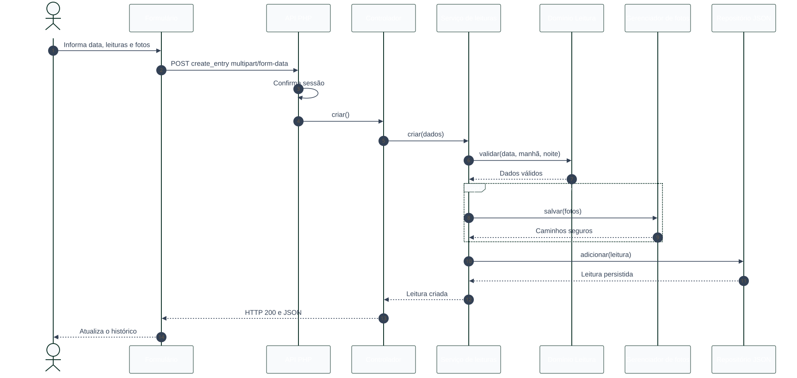

# Modelagem UML

## 1. Objetivo

Este documento apresenta as visões UML essenciais do Meu Consumo. Os diagramas
representam o comportamento e a arquitetura implementados atualmente.

## 2. Diagrama de casos de uso


[Código-fonte Mermaid dos casos de uso](diagramas/casos-de-uso.mmd)

O usuário acessa as funções de leitura somente depois da autenticação. O
administrador da hospedagem prepara credenciais, permissões e segurança do
servidor fora da interface da aplicação.

## 3. Diagrama de classes



[Código-fonte Mermaid do diagrama de classes](diagramas/classes-mvc.mmd)

### 3.1 Responsabilidades

- `Leitura` contém validação e cálculo de domínio.
- `ServicoLeituras` coordena persistência e fotos.
- `ControladorLeituras` traduz HTTP para operações da aplicação.
- `RepositorioLeituras` controla exclusivamente `consumo.json`.
- `GerenciadorFotos` valida, salva e exclui imagens.
- `ControladorAutenticacao` coordena entrada, saída e sessão.
- `RepositorioUsuarios` controla exclusivamente `usuarios.json`.

## 4. Sequência de registro de leitura



[Código-fonte Mermaid da sequência de registro](diagramas/sequencia-registro.mmd)

### 4.1 Fluxo principal

1. O formulário envia valores e fotos por `multipart/form-data`.
2. O roteador confirma que existe uma sessão autenticada.
3. O controlador encaminha os dados ao serviço de aplicação.
4. O domínio valida valores e calcula o consumo.
5. O gerenciador valida e armazena as fotos opcionais.
6. O repositório grava a leitura no JSON.
7. A API devolve a leitura criada.
8. A interface recarrega o histórico.

### 4.2 Fluxos de erro

- Dados inválidos retornam HTTP `422`.
- Sessão ausente ou expirada retorna HTTP `401`.
- Falha de infraestrutura retorna HTTP `500` e gera log no servidor.
- Se o segundo upload ou a persistência falhar, o serviço tenta remover a
  primeira foto para evitar arquivo órfão.

## 5. Dependências entre camadas

As dependências seguem o sentido abaixo:

```text
Interface → HTTP → Aplicação → Domínio
                         ↓
                  Infraestrutura
```

O domínio não conhece HTTP, JSON, sessão, arquivos ou elementos da interface.
Essa separação permite trocar a persistência sem reescrever a regra de consumo.
